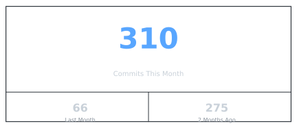
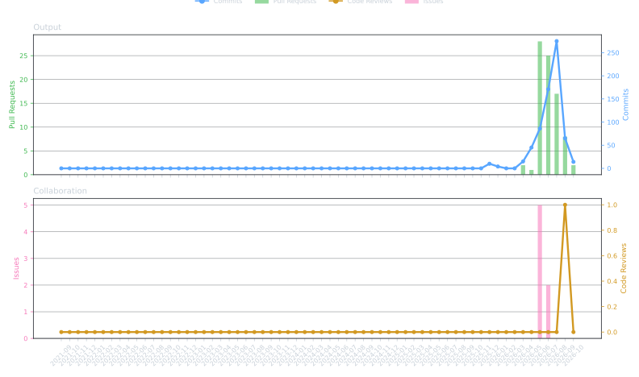
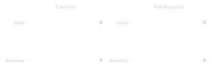

<h1 align="center">Amaresh Hebbar</h1>

  <b>AI Engineer · Agentic LLM Systems · Model Auditing · Multi Agent Infrastructure · Medical AI</b> 
I design, fine tune, and ship production grade AI systems end to end.

  
  
  
  
  
  

### About

I build agentic AI systems: multi agent pipelines, LLM infrastructure, model auditing and interpretability tooling, on device inference, and domain fine tuning, and I take them all the way to production.

* **Open source author.** Shipped **Modeldiffr** to PyPI: audits exactly what changed between a base LLM and any fine tune, quant, merge, or edit, with paired deltas and 95% bootstrap confidence intervals. Also shipped **TrueNorth** to PyPI and NPM: an LLM infrastructure engine with 1,258 passing tests, a 13 stage safety pipeline, and 8 provider routing (about 90% cost reduction).
* **Fine tuning at scale.** Published a **16 model medical AI suite** (Qwen2.5) on Hugging Face covering ICD 10, CPT, DRG coding, SNOMED mapping, clinical NLP, PM JAY classification, and Hindi medical. Every model is trained with a **QLoRA → DoRA → ORPO → merge** pipeline on a real, paired SFT dataset (also published).
* **Led a 10 person team** across frontend, backend, and mobile, delivering two concurrent AI product lines.
* **Hackathons.** SANS FIND EVIL! (DFIR Automation) · Google Cloud Rapid Agent (GitLab Partner) · INDIA RUNS (Redrob AI × Hack2Skill, Data & AI) · BITSoM Vertex Builders Pitch Fest (Top 150 of 2,300, Software Automation AI Track).
* **Research grade rigor.** Published benchmarks (100% precision on SANS DFIR triage), open SFT datasets, statistically grounded model diffs, and W&B tracked training runs.
* Based in Bengaluru, India · **Open to remote first AI engineering roles** (IST, comfortable with US and EU overlap).

### Experience

| Role | Organisation | What I do |
|------|--------------|-----------|
| **Team Lead, AI/ML Engg** | [Impossible AI](https://www.linkedin.com/company/impossible-ai/) (Bengaluru) | Building the on device LLM inference layer with cloud fallback routing for the Impossible AI product line |
| **Closed Contributor, ClinicalSearch** | [AnacodicAI Labs](https://anacodicai.org/get-started) (founded at Boston University) · contributing under project lead [Rashan Kaur](https://www.linkedin.com/in/rashan-kaur/) | Multi agent clinical evidence retrieval system for plastic and reconstructive surgery: AWS Strands Agents SDK, Pinecone vector search, FastAPI backend, Vite and TypeScript frontend, a fully local Ollama inference stack, and benchmark suites for extraction quality and LLM provider comparison |

Featured on LinkedIn: [view post](https://lnkd.in/p/dp_jS7S2)

### Tech Stack

  
  
  
  

  
  
  
  
  
  
  
  
  
  

  
  
  
  
  
  

  
  
  
  
  

  
  
  
  
  
  

  
  
  
  
  

### Featured Projects

| Project | What it does | Stack | Highlights |
|---------|-------------|-------|-----------|
| **[Modeldiffr](https://github.com/amareshhebbar/modeldiffr)** | Audits what changed between a base LLM and any fine tune, quant, merge, or edit. One command runs both models under identical conditions and reports what moved, by how much, and whether it beats evaluation noise | Python · PyTorch · Transformers | **PyPI** · paired deltas with 95% bootstrap CIs · token level KL divergence · CI gate mode · roadmap to crosscoder and causal diffing |
| **[TrueNorth](https://github.com/amareshhebbar/TrueNorth)** | Developer first LLM infrastructure engine: declare the outcome in YAML, it owns the full multi turn conversation lifecycle | Python · TS · Go · RN | 1,258 tests · 4 SDKs · hallucination firewall (94%) · 8 provider routing · **PyPI + NPM** |
| **[GitGrounded](https://github.com/amareshhebbar/gitgrounded)** | Catches AI regressions before users do: diffs a prompt or model change, has an AI write targeted tests, judges old vs new, returns PASS, WARN, or FAIL | Python · Claude · Groq · Ollama · Streamlit | Git mode and live endpoint mode · version history per API · automatic PR comments · 22 tests in CI · BITSoM Vertex Builders Pitch Fest |
| **[LogPoseSIFT](https://github.com/amareshhebbar/LogPoseSIFT)** | Autonomous DFIR orchestrator: MCP server wraps 200+ SANS SIFT tools as typed Go endpoints | Go · Claude · Gemini · MCP · Volatility 3 | 100% precision · 92.8% recall · 0 hallucinations · SANS FIND EVIL! Hackathon |
| **[ShiftLeft](https://github.com/amareshhebbar/ShiftLeft)** | Autonomous 5 agent bug fixing pipeline: reads repo → triages → generates fix → opens MR | Python · LangGraph · Gemini · GitLab MCP | End to end in about 60s, zero human steps · Google Cloud Rapid Agent Hackathon |
| **[BitNarrow](https://github.com/amareshhebbar/bitnarrow)** | Zero training, in place weight surgery on 4 bit quantized LLMs using Winsorized activation profiling and Gram Schmidt orthogonal projection across the residual stream | Python · PyTorch · bitsandbytes · Unsloth | Full spectrum projection across o, gate, up, down layers · 95th percentile outlier clamping · 386MB hot swap weight patch · basis for Modeldiffr layer 2 |
| **[HireSignal](https://github.com/amareshhebbar/hiresignal)** | Ranks 100K candidates against a Senior AI Engineer JD in about 35s on CPU: multi signal scoring, honeypot detection, semantic embeddings | Python · sentence transformers · NumPy | No GPU, no API, no network during ranking · 85 honeypots caught · 10 tests · INDIA RUNS Hackathon |
| **layerFourth** *(private repo)* | Fully local autonomous AI web scraper: headed Chromium via raw CDP (no Playwright or Selenium), AI driven mouse and keyboard control, 4 layer extraction fallback (DOM → Accessibility Tree → Network sniff → Vision OCR) | Python · CDP · Vector DB | 134/134 tests passing across 12 build phases · dual layer vector memory (ephemeral + persistent) |
| **[PocketLLM](https://github.com/amareshhebbar/PocketLLM)** | 100% offline Android AI chat running LLMs on device via a MediaPipe C++ bridge | React Native · Expo · MediaPipe C++ · AWS S3 | 9 open weight models (0.4 to 5.2 GB) · prompts never leave the device |
| **[Medical AI Suite](https://huggingface.co/AmareshHebbar)** | 16 fine tuned Qwen2.5 specialist models for medical coding, billing and clinical NLP | QLoRA · DoRA · ORPO · Unsloth · HF | 13 published models + 16 open SFT datasets · 2 live demos · Apache 2.0 |
| **[raiseTicket / IssueLoop](https://github.com/amareshhebbar/raiseTicket)** | AI managed ticket queue for open source repos: test run failures become LLM triaged tickets, fix proposals, re tests, and escalations | Python · Supabase · Ollama | Local first embeddings and reasoning · pluggable provider config |
| **[OceanAI Website](https://github.com/amareshhebbar/oceanai_website)** | Investor grade 3D product site for OceanAI, the Studio Ilios health platform | Next.js · TypeScript | 65 files, 28 routes · live Claude API playground demos embedded |
| **[HatPet](https://github.com/amareshhebbar/hatpet)** | Custom Linux desktop pet: transparent, borderless, always on top window that wanders the screen in 8 directions, idles, and responds to drag | Godot 4 · GDScript | XWayland compatible movement (native Wayland blocks window repositioning) · built from scratch, no pet framework |

Fine tuned models live on **[Hugging Face](https://huggingface.co/AmareshHebbar)** · Training runs tracked on **[Weights & Biases](https://wandb.ai/amareshhebbar-/axiomapper)**

### Hugging Face: Medical AI Fine Tuned Model Suite

A suite of **Qwen2.5 specialist models**, one per clinical task. Each model is trained through a consistent **QLoRA → DoRA → ORPO → merge** pipeline (via [Unsloth](https://github.com/unslothai/unsloth) + TRL) on a **dedicated, published SFT dataset**, with no synthetic training data. Released under **Apache 2.0**; training tracked on [W&B](https://wandb.ai/amareshhebbar-/axiomapper).

> Collection: **[Medical AI Fine Tuned Model Suite](https://huggingface.co/collections/AmareshHebbar/medical-ai-fine-tuned-model-suite)** · Datasets: **[AxisMapper Medical AI Suite](https://huggingface.co/collections/AmareshHebbar/axismapper-medical-ai-suite)**

| Model | Size | Task | Dataset (rows) | Method | GPU |
|-------|:----:|------|----------------|--------|-----|
| [icd10-coder-qwen25-7b](https://huggingface.co/AmareshHebbar/icd10-coder-qwen25-7b) | 7B | Clinical text → ICD 10 CM code + justification | [icd10-coder-sft](https://huggingface.co/datasets/AmareshHebbar/icd10-coder-sft) (74.7k) | QLoRA → DoRA → ORPO → merge | A40 48GB |
| [icd10-coder-qwen25-7b-merged](https://huggingface.co/AmareshHebbar/icd10-coder-qwen25-7b-merged) | 8B | Merged full weights build of the ICD 10 coder (no adapter load) | [icd10-coder-sft](https://huggingface.co/datasets/AmareshHebbar/icd10-coder-sft) (74.7k) | QLoRA → DoRA → ORPO → merge | A40 48GB |
| [snomed-mapper-qwen25-7b](https://huggingface.co/AmareshHebbar/snomed-mapper-qwen25-7b) | 7B | Clinical concept → SNOMED CT mapping | [snomed-mapper-sft](https://huggingface.co/datasets/AmareshHebbar/snomed-mapper-sft) (74.7k) | QLoRA → DoRA → ORPO → merge | A40 48GB |
| [clinical-summarizer-qwen25-7b](https://huggingface.co/AmareshHebbar/clinical-summarizer-qwen25-7b) | 7B | Clinical note summarization | [clinical-summarizer-sft](https://huggingface.co/datasets/AmareshHebbar/clinical-summarizer-sft) (30k) | QLoRA → DoRA → ORPO → merge | A40 48GB |
| [medical-billing-qwen25-3b](https://huggingface.co/AmareshHebbar/medical-billing-qwen25-3b) | 3B | Medical billing code generation | [medical-billing-sft](https://huggingface.co/datasets/AmareshHebbar/medical-billing-sft) (17k) | QLoRA → DoRA → ORPO → merge | A40 48GB |
| [cpt-coder-qwen25-3b](https://huggingface.co/AmareshHebbar/cpt-coder-qwen25-3b) | 3B | Procedure text → CPT code | [cpt-coder-sft](https://huggingface.co/datasets/AmareshHebbar/cpt-coder-sft) (17k) | QLoRA → DoRA → ORPO → merge | A40 48GB |
| [radiology-coder-qwen25-3b](https://huggingface.co/AmareshHebbar/radiology-coder-qwen25-3b) | 3B | Radiology report → diagnostic code | [radiology-coder-sft](https://huggingface.co/datasets/AmareshHebbar/radiology-coder-sft) (25.1k) | QLoRA → DoRA → ORPO → merge | A40 48GB |
| [pmjay-classifier-qwen25-3b](https://huggingface.co/AmareshHebbar/pmjay-classifier-qwen25-3b) | 3B | India PM JAY scheme package classification | [pmjay-classifier-sft](https://huggingface.co/datasets/AmareshHebbar/pmjay-classifier-sft) (11.1k) | QLoRA → DoRA → ORPO → merge | A40 48GB |
| [discharge-qa-qwen25-3b](https://huggingface.co/AmareshHebbar/discharge-qa-qwen25-3b) | 3B | QA over discharge summaries | [discharge-qa-sft](https://huggingface.co/datasets/AmareshHebbar/discharge-qa-sft) (30k) | QLoRA → DoRA → ORPO → merge | A40 48GB |
| [medical-ner-qwen25-3b](https://huggingface.co/AmareshHebbar/medical-ner-qwen25-3b) | 3B | Clinical named entity recognition | [medical-ner-sft](https://huggingface.co/datasets/AmareshHebbar/medical-ner-sft) (16.7k) | QLoRA → DoRA → ORPO → merge | A40 48GB |
| [hindi-medical-qwen25-3b](https://huggingface.co/AmareshHebbar/hindi-medical-qwen25-3b) | 3B | Hindi language medical assistant | [hindi-medical-sft](https://huggingface.co/datasets/AmareshHebbar/hindi-medical-sft) (19.7k) | QLoRA → DoRA → ORPO → merge | A40 48GB |
| [icd10-to-drg-qwen25-1b](https://huggingface.co/AmareshHebbar/icd10-to-drg-qwen25-1b) | 1.5B | ICD 10 → DRG for reimbursement grouping | [icd10-to-drg-sft](https://huggingface.co/datasets/AmareshHebbar/icd10-to-drg-sft) (5.39k) | QLoRA → DoRA → ORPO → merge | A40 48GB |
| [insurance-classifier-qwen25-1b](https://huggingface.co/AmareshHebbar/insurance-classifier-qwen25-1b) | 1.5B | CPT/HCPCS → Stark Law DHS classification | [insurance-classifier-sft](https://huggingface.co/datasets/AmareshHebbar/insurance-classifier-sft) (1.6k) | QLoRA → DoRA → ORPO → merge | A40 48GB |
| [ayurveda-icd-qwen25-1b](https://huggingface.co/AmareshHebbar/ayurveda-icd-qwen25-1b) | 1.5B | Ayurveda term → ICD mapping | [ayurveda-icd-sft](https://huggingface.co/datasets/AmareshHebbar/ayurveda-icd-sft) (3k) | QLoRA → DoRA → ORPO → merge | A40 48GB |
| [pharmacy-ner-qwen25-1b](https://huggingface.co/AmareshHebbar/pharmacy-ner-qwen25-1b) | 1.5B | Pharmacy and drug entity recognition | [pharmacy-ner-sft](https://huggingface.co/datasets/AmareshHebbar/pharmacy-ner-sft) (3.5k) | QLoRA → DoRA → ORPO → merge | A40 48GB |

Pipeline (all models): Qwen2.5 Instruct base → <b>QLoRA</b> SFT (4 bit NF4, rank 16, α 32) → <b>DoRA</b> → <b>ORPO</b> preference alignment → adapter <b>merge</b>. Optimizer paged_adamw_8bit · cosine schedule, LR 0.0002 · trained on RunPod (NVIDIA A40 48GB) via Unsloth + TRL. Per model wall time ranges from about 0.4 h (1.5B configs) to about 1.9 h (7B configs). Training tracked at <a href="https://wandb.ai/amareshhebbar-/axiomapper">wandb.ai/amareshhebbar</a>. Datasets built from authoritative real world sources (for example CMS FY2026 ICD 10 CM and the HCPCS Stark Law DHS list), not LLM generated.

**Live demos (Spaces):** [icd10 coder demo](https://huggingface.co/spaces/AmareshHebbar/icd10-coder-demo) · [hiresignal](https://huggingface.co/spaces/AmareshHebbar/hiresignal)

### Hackathons

| Submission | Hackathon | Track | What it does |
|-----------|-----------|-------|--------------|
| **[GitGrounded](https://github.com/amareshhebbar/gitgrounded)** | BITSoM Vertex × H2S Builders Pitch Fest 2026 (Top 150 of 2,300) | Software Automation AI | Tests an AI app before and after a prompt or model change, AI written targeted tests, AI judge, PASS, WARN, or FAIL verdict |
| **[ShiftLeft](https://devpost.com/software/shiftleft)** | Google Cloud Rapid Agent | GitLab Partner | Label a GitLab issue → autonomous 5 agent pipeline reads the repo, triages the bug, writes the fix, and opens an MR in under 60 seconds |
| **[Poneglyphs: ShiftLeft](https://devpost.com/software/shiftleft-ml5aep)** | Google Cloud Rapid Agent | GitLab Partner | Label a GitLab issue `shiftleft` → 5 agent pipeline reads GitLab Orbit, triages, writes fix, opens MR |
| **[LogPoseSIFT](https://devpost.com/software/logpose-sift-autonomous-dfir)** | SANS FIND EVIL! | DFIR Automation | Autonomous DFIR orchestrator: deploys an AI crew via strict MCP endpoints, runs SIFT diagnostics, triages and self corrects in seconds |
| **[AllBlue](https://devpost.com/software/allblue)** | SANS FIND EVIL! | DFIR Automation | Splunk alerts trigger autonomous AI forensic triage, with IOC findings pushed back as structured events. 100% precision, 0 hallucinations |
| **[HireSignal](https://github.com/amareshhebbar/hiresignal)** | INDIA RUNS · Redrob AI × Hack2Skill | Data & AI Challenge | Ranks 100K candidates against a Senior AI Engineer JD in about 35s on CPU: multi signal scoring, 85 honeypots detected, per candidate reasoning. [Live sandbox](https://huggingface.co/spaces/AmareshHebbar/hiresignal) |

### GitHub Stats

  <table>
    <tr>
      <td>

      </td>
      <td>

      </td>
    </tr>
  </table>

  

### Activity

  

  

  

Auto generated from live account data, refreshed every 6 hours · Last updated: <!--STATS-TIME-->2026-10-02 02:59 UTC<!--END-->

### Highlights

* Published **Modeldiffr** to PyPI (Apache 2.0)
* Published **TrueNorth** to PyPI and NPM (Apache 2.0)
* Released a **16 model medical AI suite + 16 open SFT datasets** on Hugging Face
* Applied AI Engineer on **ClinicalSearch** at [AnacodicAI Labs](https://anacodicai.org/get-started)
* **1000+ problems solved** on [LeetCode](https://leetcode.com/u/GVAmaresh/)
* B.E. Computer Science & Engineering, Dayananda Sagar College of Engineering (2021 to 2025)

  <i>Open to remote first AI engineering roles: LLM infrastructure, agentic systems, model evaluation, fine tuning, or AI product engineering.</i> 
  <b>Let's build something intelligent.</b>

  

